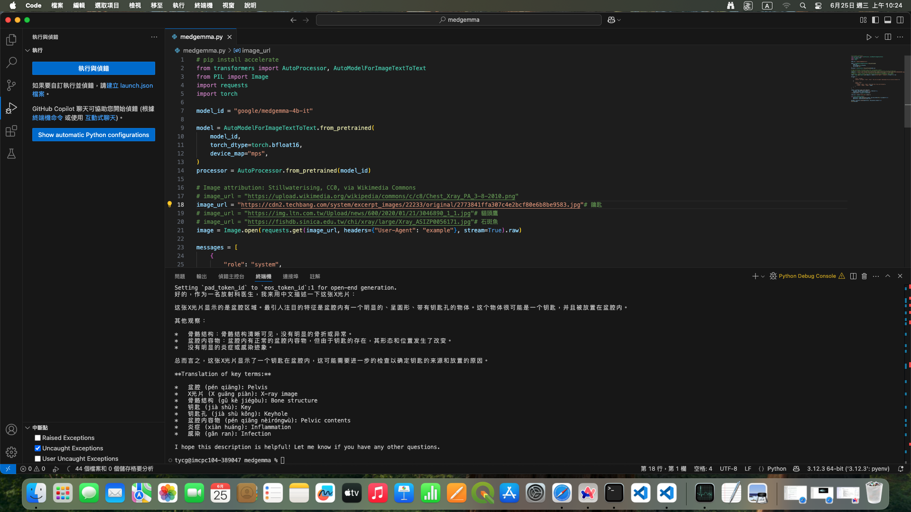

# medgemma測試

模型 medgemma-4b-it

[medgemma](https://huggingface.co/google/medgemma-4b-it)

## 輸入圖片/ 輸出結果
[貓頭鷹](https://img.ltn.com.tw/Upload/news/600/2020/01/21/3046890_1_1.jpg)
 
[鑰匙](https://cdn2.techbang.com/system/excerpt_images/22233/original/2773841ffa307c4e2bcf80e6b8be9583.jpg)
 
[範例圖](https://upload.wikimedia.org/wikipedia/commons/c/c8/Chest_Xray_PA_3-8-2010.png)
 
[石斑魚](https://fishdb.sinica.edu.tw/chi/xray/large/Xray_ASIZP0056171.jpg)
 

---

## 執行環境

mac studio M2 RAM 192G
